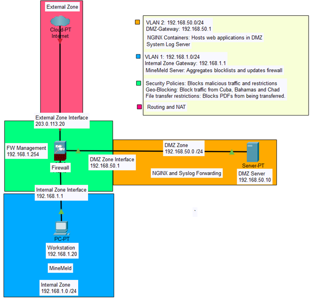

# Advanced Network Security Design

Palo Alto Networks + VMware Workstation Security Lab (ITSC-350)  
Globex Corporation – Group 6 – Calgary HQ  
Contributors: Dylan Yee, Amrit Kaur Dhiman, Aira Therens  

---

## Overview

This project demonstrates the deployment and configuration of a **Palo Alto VM-50 firewall**, Virtual Router, DMZ server, and client machines inside **VMware Workstation**.  
It follows a layered security approach with **Internal**, **DMZ**, **External**, and **Management** zones.  

**Objectives:**
- Deploy Palo Alto Firewall (v10.0) with VMware Workstation
- Configure Internal, External, DMZ, and Management zones
- Apply advanced **security policies** (file blocking, data filtering, geo-blocking)
- Deploy **NGINX** and **MineMeld** containers
- Centralize **Syslog monitoring & forwarding**
- Demonstrate NAT, routing, and reconnaissance protection
- Propose a **cloud disaster recovery (DR)** strategy

---

## Network Topology



**Zones:**
- **External Zone** → Internet connection  
- **DMZ Zone** → Public-facing services (NGINX, Syslog Server)  
- **Internal Zone** → Workstations  
- **Management Zone** → Firewall admin access (192.168.1.254)  

---

## Key Configurations

### Security Policies
- **Data Filtering:** Block SSNs using regex pattern match  
- **File Blocking:** Block PDF uploads/downloads  
- **Block List:** Deny access to specific domains (via block-list.txt)  
- **International Geo-Blocking:** Deny traffic from Cuba, Bahamas, Chad  
- **Zone Protection:** Flood & reconnaissance protection enabled on External + DMZ  

### Containers
- **NGINX (DMZ Server):**
  ```bash
  docker run -d -p 8080:80 --name csf-nginx2 nginx:latest

  Verified at: https://192.168.50.10:8080

### MineMeld (Client)

sudo docker-compose up -d

- Connected to default threat feeds
- Configured External Dynamic Lists (EDLs):
    - Bad IP List
    - High Confidence List
- Applied to policy: Block Minemeld List Outside-to-Inside


###Monitoring & Logging
- Syslog Server (192.168.50.10) collects logs from firewall
- Syslog Profile + Log Forwarding applied to all policies
- Logs verified via:

tail -f /var/log/syslog

sh /tg/traffic.sh
- Exported to CSV from Firewall GUI for reporting

###NAT & Routing

- NAT Policy: allow DMZ → Internet
- Virtual Router: connects Internal, DMZ, External zones
- Default Static Route:
    - Destination: 0.0.0.0/0
    - Next Hop: External zone (ethernet1/1)

###Disaster Recovery (Proposed)
- HQ firewall connected to AWS/Azure via Site-to-Site VPN
- Replication of on-prem VMs to cloud for DR
- Automatic failover in case of Calgary HQ outage

###Credentials (Lab Only)
| System            | Username     | Password                |
| ----------------- | ------------ | ----------------------- |
| Firewall Admin    | admin        | GxAdm!24#Net\@10        |
| Syslog Server     | syslogserver | S!yL0g#Srv\@2025        |
| Syslog Root       | root         | UbR00t!#Sec\@25         |
| Domain Controller | dcadmin      | D0ma!n#AdM\@10\$        |
| Workstation User  | user10       | WrkUs3r#G10!@           |
| MineMeld Admin    | minemeld     | Mm#AdM!23\@FeEd         |
| NGINX Admin       | ngadmin      | NginX!#Srv\@10\$        |
| Traffic Generator | root         | Pal0Alt0! (lab default) |

###Task Tracker
| Name  | Task                              | Time Taken | Date         |
| ----- | --------------------------------- | ---------- | ------------ |
| Dylan | MineMeld Container                | 3h         | Apr 16, 2025 |
| Dylan | Extended Block List               | 1h         | Apr 16, 2025 |
| Dylan | Reconnaissance Protection         | 1h         | Apr 16, 2025 |
| Aira  | NGINX Container                   | 2h         | Apr 16, 2025 |
| Aira  | International Traffic Block       | 1h         | Apr 17, 2025 |
| Amrit | File & PDF Blocking               | 1h         | Apr 17, 2025 |
| Amrit | Syslog Forwarding to Linux Server | 5h         | Apr 16, 2025 |

### 🎓 Lessons Learned
- VMware VMnet setup is critical for lab pod stability
- Palo Alto Firewall provides granular control over files, data, geo, and reconnaissance threats
- Containers (NGINX, MineMeld) extend firewall functionality effectively
- Centralized Syslog logging simplifies monitoring & reporting
- A hybrid DR model (on-prem + cloud) provides resilience against outages
